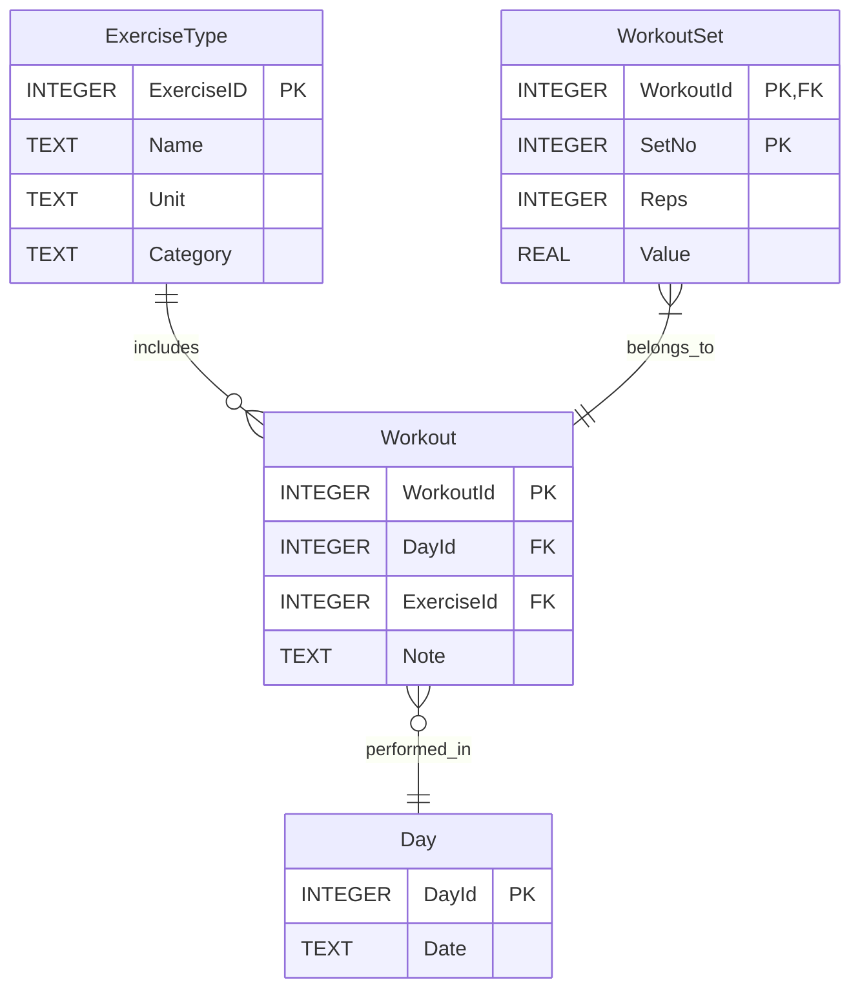

# Introduction
Simple Python and SQL code to populate my exercise database with records, and (soon) generate graphs and statistics from the database. The data is stored in an SQLite database with the following layout:

